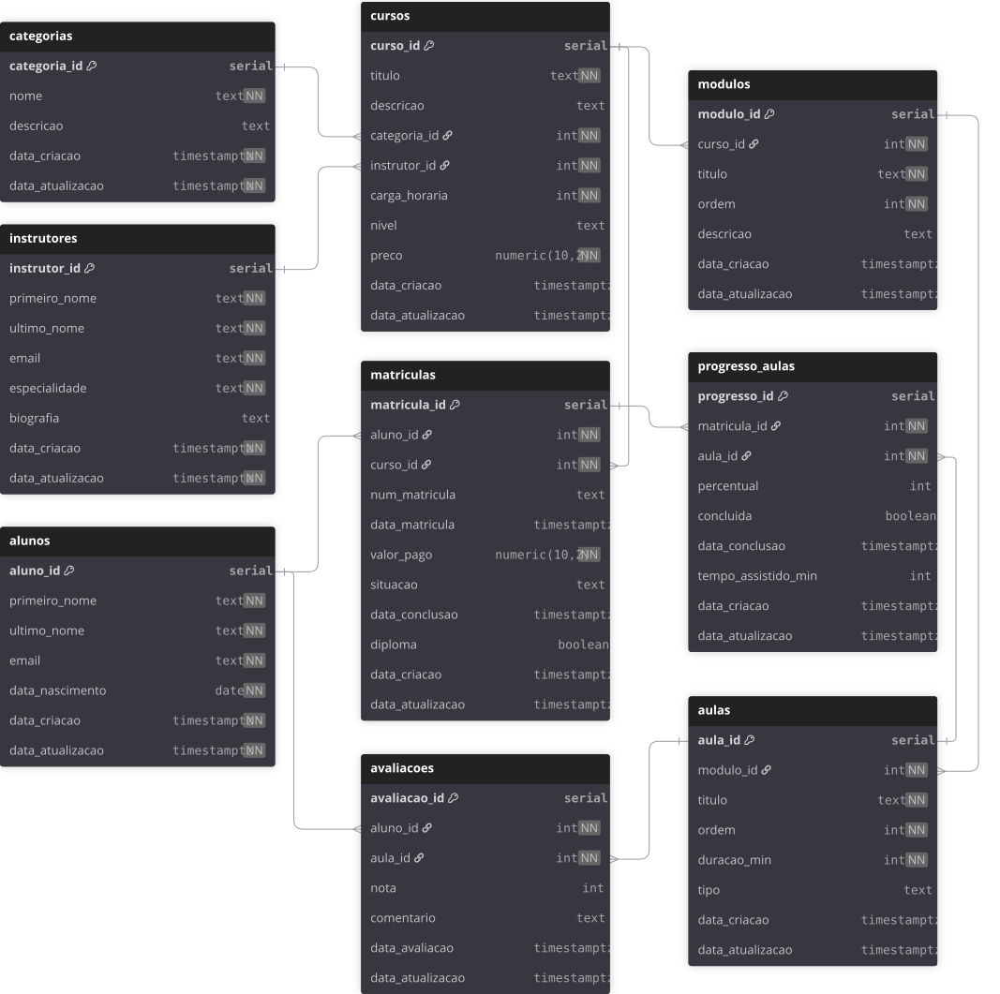

# Modelagem Lógica — EduTech

<br>

> Versão: validada (v1)  
> Objetivo: descrever entidades, atributos, chaves e relacionamentos normalizados até 3FN, com base no schema SQL implementado e testado.

<br>

## 1) Entidades e principais atributos

| Entidade | Atributos principais | Observações |
|-----------|----------------------|--------------|
| **alunos** | `aluno_id` (PK), `primeiro_nome`, `ultimo_nome`, `email` [UNIQUE], `data_nascimento`, `data_criacao`, `data_atualizacao` | Contém dados pessoais de cada aluno. |
| **instrutores** | `instrutor_id` (PK), `primeiro_nome`, `ultimo_nome`, `email` [UNIQUE], `especialidade`, `biografia`, `data_criacao`, `data_atualizacao` | Cada instrutor pode ministrar vários cursos. |
| **categorias** | `categoria_id` (PK), `nome` [UNIQUE], `descricao`, `data_criacao`, `data_atualizacao` | Classifica os cursos por área temática. |
| **cursos** | `curso_id` (PK), `titulo` [UNIQUE], `descricao`, `categoria_id` (FK), `instrutor_id` (FK), `carga_horaria`, `nivel`, `preco`, `data_criacao`, `data_atualizacao` | Relaciona categoria e instrutor; contém metadados do curso. |
| **modulos** | `modulo_id` (PK), `curso_id` (FK), `titulo`, `ordem`, `descricao`, `data_criacao`, `data_atualizacao` | Agrupa aulas dentro de um curso. |
| **aulas** | `aula_id` (PK), `modulo_id` (FK), `titulo`, `ordem`, `duracao_min`, `tipo`, `data_criacao`, `data_atualizacao` | Conteúdo individual dentro de um módulo. |
| **matriculas** | `matricula_id` (PK), `aluno_id` (FK), `curso_id` (FK), `num_matricula` [UNIQUE], `data_matricula`, `valor_pago`, `situacao`, `data_conclusao`, `diploma`, `data_criacao`, `data_atualizacao` | Registro transacional da inscrição de um aluno em um curso. |
| **progresso_aulas** | `progresso_id` (PK), `matricula_id` (FK), `aula_id` (FK), `percentual`, `concluida`, `data_conclusao`, `tempo_assistido_min`, `data_criacao`, `data_atualizacao` | Monitora o avanço do aluno em cada aula. |
| **avaliacoes** | `avaliacao_id` (PK), `aluno_id` (FK), `aula_id` (FK), `nota`, `comentario`, `data_avaliacao`, `data_atualizacao` | Feedback do aluno sobre uma aula específica. |

<br>

## 2) Relacionamentos e cardinalidades

| Origem | Destino | Tipo | Descrição |
|--------|----------|------|-----------|
| categorias | cursos | 1 → N | Uma categoria possui vários cursos. |
| instrutores | cursos | 1 → N | Um instrutor ministra vários cursos. |
| cursos | modulos | 1 → N | Um curso é composto por vários módulos. |
| modulos | aulas | 1 → N | Cada módulo contém várias aulas. |
| alunos | cursos | N ↔ N (via `matriculas`) | Relação de inscrição entre alunos e cursos. |
| matriculas | progresso_aulas | 1 → N | Uma matrícula possui múltiplos registros de progresso. |
| aulas | progresso_aulas | 1 → N | Cada aula pode aparecer em vários registros de progresso. |
| alunos | avaliacoes | 1 → N | Um aluno pode avaliar várias aulas. |
| aulas | avaliacoes | 1 → N | Uma aula pode receber várias avaliações. |

<br>

## 3) Regras e constraints-chave

### Integridade e unicidade
- **FKs obrigatórias:**
  - `cursos(categoria_id)` → `categorias(categoria_id)`
  - `cursos(instrutor_id)` → `instrutores(instrutor_id)`
  - `modulos(curso_id)` → `cursos(curso_id)`
  - `aulas(modulo_id)` → `modulos(modulo_id)`
  - `matriculas(aluno_id)` → `alunos(aluno_id)`
  - `matriculas(curso_id)` → `cursos(curso_id)`
  - `progresso_aulas(matricula_id)` → `matriculas(matricula_id)`
  - `progresso_aulas(aula_id)` → `aulas(aula_id)`
  - `avaliacoes(aluno_id)` → `alunos(aluno_id)`
  - `avaliacoes(aula_id)` → `aulas(aula_id)`
- **UNIQUE**:
  - `modulos(curso_id, ordem)`
  - `aulas(modulo_id, ordem)`
  - `matriculas(aluno_id, curso_id)`
  - `progresso_aulas(matricula_id, aula_id)`
  - `avaliacoes(aluno_id, aula_id)`
- **Campos únicos individuais**: `alunos.email`, `instrutores.email`, `categorias.nome`, `cursos.titulo`, `matriculas.num_matricula`.

### Domínios e CHECKs
| Campo | Restrição |
|--------|------------|
| `cursos.nivel` | ∈ {livre, tecnico, graduacao, especializacao} |
| `aulas.tipo` | ∈ {EAD, hibrido, presencial} |
| `matriculas.situacao` | ∈ {ativo, inativo, concluido} |
| `avaliacoes.nota` | ∈ [0, 5] |
| `cursos.carga_horaria` | ≥ 1 |
| `cursos.preco` | ≥ 0 |
| `modulos.ordem`, `aulas.ordem` | ≥ 1 |
| `aulas.duracao_min` | ≥ 1 |
| `progresso_aulas.percentual` | 0–100 |
| `progresso_aulas.tempo_assistido_min` | ≥ 0 |

### Índices sugeridos
- Todos os campos FK: `categoria_id`, `instrutor_id`, `curso_id`, `modulo_id`, `aluno_id`, `aula_id`.
- `matriculas(situacao)` → filtros por status.
- `avaliacoes(aula_id, nota)` → métricas de satisfação.
- `progresso_aulas(matricula_id, aula_id)` → desempenho por aula.

<br>

## 4) Normalização (até 3FN)

- **1FN** — todos os atributos são atômicos; não há campos compostos ou multivalorados.  
- **2FN** — todas as dependências parciais eliminadas; PKs são simples (`id` surrogate) e combinações são controladas por constraints UNIQUE.  
- **3FN** — cada atributo não-chave depende somente da PK:  
  - `valor_pago` está em `matriculas` pois reflete um evento (transação), não o preço atual do curso.  
  - Atributos calculados (como médias, totais e percentuais globais) serão derivados via *views* e não armazenados em tabela.

<br>

## 5) Resumo visual (hierarquia e cardinalidades)

```bash
categorias (1) ────< (N) cursos (1) ────< (N) modulos (1) ────< (N) aulas
instrutores (1) ────< (N) cursos
alunos (N) ────< (N) cursos via matriculas
matriculas (1) ────< (N) progresso_aulas >──── (1) aulas
alunos (1) ────< (N) avaliacoes >──── (1) aulas
```

<br>

### Diagrama ER



<br>

## 6) Decisões de projeto

- Uso de **surrogate keys (SERIAL)** para simplicidade, interoperabilidade e importação em Python / APIs.  
- `valor_pago` mantém o histórico transacional sem violar 3FN.  
- **Gerar `num_matricula` automaticamente** no formato `AASSMM#####` (via trigger).  
- `diploma` adicionado em `matriculas` para registrar conclusão com base em regra de negócio (% de progresso).  
- Domínios (`CHECK`) e `UNIQUE` compostos usados para reforçar integridade sem precisar de triggers adicionais.  
- Todos os campos de auditoria (`data_criacao`, `data_atualizacao`) padronizados com `DEFAULT NOW()`.

<br>

📘 **Status:**  
Modelo implementado, validado e executado com sucesso no PostgreSQL (via Docker).  
Pronto para integração com camada Python de geração de dados e futuras *views analíticas*.
