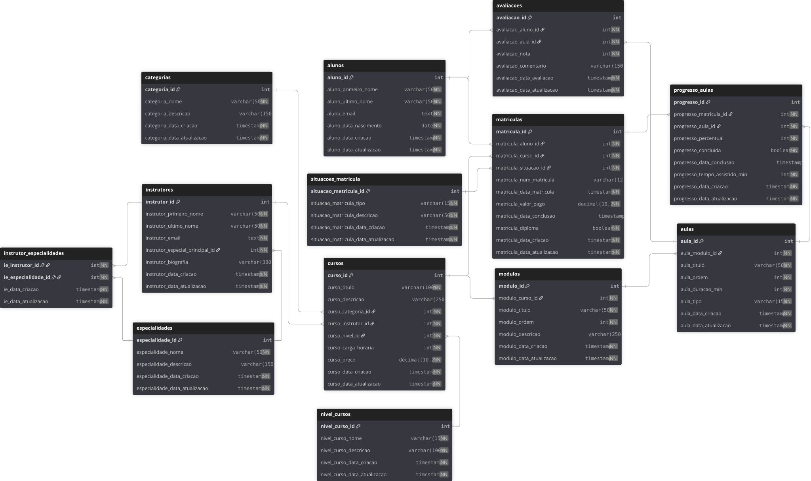

# Modelagem Lógica — EduTech

> Versão: v2.0 (revisada e validada)  
> Objetivo: descrever as entidades, chaves, relacionamentos e constraints com base no schema **`edutech`** implementado no PostgreSQL.  
> Nível de normalização: até **3FN**.

<br>

## 1️⃣ Entidades e principais atributos

| Entidade | Atributos principais | Observações |
|-----------|----------------------|--------------|
| **alunos** | `aluno_id` (PK), `aluno_primeiro_nome`, `aluno_ultimo_nome`, `aluno_email` [UNIQUE], `aluno_data_nascimento`, `aluno_data_criacao`, `aluno_data_atualizacao` | Registra os dados pessoais e de contato do aluno. |
| **especialidades** | `especialidade_id` (PK), `especialidade_nome` [UNIQUE], `especialidade_descricao`, `especialidade_data_criacao`, `especialidade_data_atualizacao` | Define áreas de atuação dos instrutores. |
| **categorias** | `categoria_id` (PK), `categoria_nome` [UNIQUE], `categoria_descricao`, `categoria_data_criacao`, `categoria_data_atualizacao` | Classifica os cursos por área temática. |
| **nivel_cursos** | `nivel_curso_id` (PK), `nivel_curso_nome` [UNIQUE], `nivel_curso_descricao`, `nivel_curso_data_criacao`, `nivel_curso_data_atualizacao` | Define o nível de dificuldade de cada curso. |
| **situacoes_matricula** | `situacao_matricula_id` (PK), `situacao_matricula_tipo` [UNIQUE], `situacao_matricula_descricao`, `situacao_matricula_data_criacao`, `situacao_matricula_data_atualizacao` | Lista os possíveis status da matrícula (ativa, trancada, concluída...). |
| **instrutores** | `instrutor_id` (PK), `instrutor_primeiro_nome`, `instrutor_ultimo_nome`, `instrutor_email` [UNIQUE], `instrutor_especial_principal_id` (FK), `instrutor_biografia`, `instrutor_data_criacao`, `instrutor_data_atualizacao` | Cada instrutor possui uma especialidade principal e pode ministrar vários cursos. |
| **cursos** | `curso_id` (PK), `curso_titulo` [UNIQUE], `curso_descricao`, `curso_categoria_id` (FK), `curso_instrutor_id` (FK), `curso_nivel_id` (FK), `curso_carga_horaria`, `curso_preco`, `curso_data_criacao`, `curso_data_atualizacao` | Representa o curso em si, vinculado à categoria, instrutor e nível. |
| **modulos** | `modulo_id` (PK), `modulo_curso_id` (FK), `modulo_titulo`, `modulo_ordem` [UNIQUE por curso], `modulo_descricao`, `modulo_data_criacao`, `modulo_data_atualizacao` | Agrupa aulas dentro de um curso, mantendo a sequência de apresentação. |
| **aulas** | `aula_id` (PK), `aula_modulo_id` (FK), `aula_titulo`, `aula_ordem` [UNIQUE por módulo], `aula_duracao_min`, `aula_tipo` [CHECK], `aula_data_criacao`, `aula_data_atualizacao` | Unidade mínima de conteúdo (vídeo, presencial, híbrido). |
| **matriculas** | `matricula_id` (PK), `matricula_aluno_id` (FK), `matricula_curso_id` (FK), `matricula_situacao_id` (FK), `matricula_num_matricula` [UNIQUE], `matricula_data_matricula`, `matricula_valor_pago`, `matricula_data_conclusao`, `matricula_diploma`, `matricula_data_criacao`, `matricula_data_atualizacao` | Registra a inscrição do aluno em um curso, com status e valor pago. |
| **instrutor_especialidades** | (`ie_instrutor_id`, `ie_especialidade_id`) (PKs compostas e FKs), `ie_data_criacao`, `ie_data_atualizacao` | Relação N:N entre instrutores e especialidades. |
| **progresso_aulas** | `progresso_id` (PK), `progresso_matricula_id` (FK), `progresso_aula_id` (FK), `progresso_percentual`, `progresso_concluida`, `progresso_data_conclusao`, `progresso_tempo_assistido_min`, `progresso_data_criacao`, `progresso_data_atualizacao` | Monitora o progresso individual do aluno em cada aula. |
| **avaliacoes** | `avaliacao_id` (PK), `avaliacao_aluno_id` (FK), `avaliacao_aula_id` (FK), `avaliacao_nota` [CHECK 0–5], `avaliacao_comentario`, `avaliacao_data_avaliacao`, `avaliacao_data_atualizacao` | Feedback do aluno sobre uma aula específica. |

<br>

## 2️⃣ Relacionamentos e cardinalidades

| Origem | Destino | Tipo | Descrição |
|--------|----------|------|------------|
| **categorias** | **cursos** | 1 → N | Cada categoria agrupa vários cursos. |
| **instrutores** | **cursos** | 1 → N | Um instrutor ministra múltiplos cursos. |
| **nivel_cursos** | **cursos** | 1 → N | Um nível é associado a vários cursos. |
| **cursos** | **modulos** | 1 → N (CASCADE) | Ao excluir um curso, todos os módulos e aulas são removidos. |
| **modulos** | **aulas** | 1 → N (CASCADE) | Ao excluir um módulo, suas aulas são excluídas. |
| **alunos** | **cursos** | N ↔ N (via `matriculas`) | Relação transacional entre aluno e curso. |
| **matriculas** | **progresso_aulas** | 1 → N (RESTRICT) | Não é possível excluir matrícula com progresso. |
| **aulas** | **progresso_aulas** | 1 → N (CASCADE) | Ao remover aula, remove progresso associado. |
| **alunos** | **avaliacoes** | 1 → N (RESTRICT) | Aluno não pode ser excluído se tiver avaliações. |
| **aulas** | **avaliacoes** | 1 → N (CASCADE) | Ao excluir aula, remove avaliações ligadas. |
| **instrutores** | **especialidades** | N ↔ N (via `instrutor_especialidades`) | Um instrutor pode ter múltiplas especialidades. |

<br>

## 3️⃣ Regras e constraints-chave

### Integridade referencial
- **FKs obrigatórias e políticas ON DELETE:**
  - `modulos.modulo_curso_id` → `cursos.curso_id` **ON DELETE CASCADE**
  - `aulas.aula_modulo_id` → `modulos.modulo_id` **ON DELETE CASCADE**
  - `progresso_aulas.progresso_matricula_id` → `matriculas.matricula_id` **ON DELETE RESTRICT**
  - `progresso_aulas.progresso_aula_id` → `aulas.aula_id` **ON DELETE CASCADE**
  - `avaliacoes.avaliacao_aluno_id` → `alunos.aluno_id` **ON DELETE RESTRICT**
  - `avaliacoes.avaliacao_aula_id` → `aulas.aula_id` **ON DELETE CASCADE**
  - `instrutor_especialidades.ie_instrutor_id` → `instrutores.instrutor_id` **ON DELETE CASCADE**
  - `instrutor_especialidades.ie_especialidade_id` → `especialidades.especialidade_id` **ON DELETE RESTRICT**

### Unicidade
| Constraint | Descrição |
|-------------|------------|
| `aluno_email`, `instrutor_email`, `categoria_nome`, `curso_titulo`, `matricula_num_matricula` | Campos únicos individuais. |
| `(modulo_curso_id, modulo_ordem)` | Ordem única de módulo por curso. |
| `(aula_modulo_id, aula_ordem)` | Ordem única de aula por módulo. |
| `(matricula_aluno_id, matricula_curso_id)` | Um aluno não se matricula duas vezes no mesmo curso. |
| `(progresso_matricula_id, progresso_aula_id)` | Cada matrícula tem um progresso por aula. |
| `(avaliacao_aluno_id, avaliacao_aula_id)` | Um aluno avalia cada aula apenas uma vez. |

### Domínios e CHECKs
| Campo | Restrição |
|--------|-----------|
| `aula_tipo` | IN ('EAD', 'hibrido', 'presencial') |
| `avaliacao_nota` | BETWEEN 0 AND 5 |
| `curso_carga_horaria`, `aula_duracao_min`, `modulo_ordem`, `aula_ordem` | ≥ 1 |
| `curso_preco`, `matricula_valor_pago`, `progresso_tempo_assistido_min` | ≥ 0 |
| `progresso_percentual` | 0–100 |

<br>

## 4️⃣ Normalização

- **1FN** – atributos atômicos e colunas bem tipadas.  
- **2FN** – dependências parciais eliminadas; PKs simples ou compostas apenas quando necessário.  
- **3FN** – nenhum atributo não-chave depende de outra não-chave (ex.: `matricula_valor_pago` reflete transação, não o preço do curso).  
- Campos calculáveis ou agregados (médias, totais) serão obtidos em **views** analíticas, não armazenados.

<br>

## 5️⃣ Hierarquia visual

```bash
categorias (1) ───< (N) cursos (1) ───< (N) modulos (1) ───< (N) aulas
instrutores (1) ───< (N) cursos
alunos (N) ───< (N) cursos via matriculas
matriculas (1) ───< (N) progresso_aulas >─── (1) aulas
alunos (1) ───< (N) avaliacoes >─── (1) aulas
instrutores (N) ───< (N) especialidades via instrutor_especialidades
```

<br>

### Diagrama ER


<br>

## 6️⃣ Decisões de projeto
- Uso de surrogate keys (`SERIAL`) para simplificar joins e compatibilidade com geração de dados via Python.
- Políticas `ON DELETE` ajustadas conforme contexto:
    - CASCADE para dependências hierárquicas (conteúdo).
    - RESTRICT para histórico e auditoria.
- Triggers BEFORE UPDATE automatizam `*_data_atualizacao`.
- `COMMENT ON` garante documentação viva dentro do banco.
- A camada Python será responsável por gerar dados coerentes (Faker + seeds).
- Domínios CHECK reforçam integridade sem triggers adicionais.
- Preparado para integração futura com views de relatórios (`inscrições por curso`, `avaliações por média`, etc.).

<br>

## 7️⃣ Diagrama ER (atualizado)
Novo diagrama a partir do tables.sql com todas as FKs e políticas ON DELETE disponível em [svg](diagrama02_Edutech.svg) ou em [pdf](diagrama02_Edutech.pdf).


<br>

📘 Status:
Schema 100 % validado, triggers e comentários aplicados, integridade referencial testada (CASCADE / RESTRICT).
